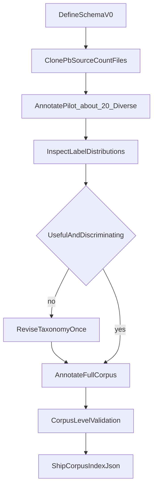

# Metadata Preparation Plan

Scope of this document: **only** how we will design, validate, and produce the corpus metadata (`corpus_index.json`). It intentionally excludes the rest of the system (agents, feedback loops, judge, harness) — see the full project plan for that.

---

## 1. Goal

Produce a per-story metadata index over the local [pb-source](https://github.com/global-asp/pb-source) `/en` corpus that simultaneously serves two purposes:

1. **Agentic search** — lets the Planner retrieve relevant stories as inspiration for a given child request.
2. **Conversation representation** — the same field values represent what the child wants, so extracting from a child's request and annotating a corpus story produce the same shape of object.

```
                        METADATA
                       /        \
                      /          \
             Agentic Search    Conversation
                    |               |
          "Find relevant       "What sounds
             stories"           fun to you?"
```

---

## 2. Data source (context only)

- Corpus: `pb-source/en/*.md` (Pratham Books / StoryWeaver, CC BY 4.0 / Public Domain)
- Exact file count is **not assumed** — `index_corpus.py` establishes it from the actual local clone (approximately in the hundreds per the GitHub listing; do not design around a specific number)
- Each file: `# Title`, `##`-delimited page sections, footer metadata block (`* License:`, `* Text:`, etc.)

---

## 3. Taxonomy v0 — 10 fields

Derived from direct inspection of a diverse cross-section of the actual corpus (not filename-keyword guessing).

| # | Field | Controlled values | Child-facing? |
|---|-------|--------------------|----------------|
| 1 | `reading_band` | `5-6`, `7-8`, `9-10` | Mostly internal |
| 2 | `story_type` | `everyday`, `adventure`, `fantasy`, `mystery`, `folktale`, `discovery/learning`, `bedtime` | Yes |
| 3 | `protagonist_type` | `child`, `animal`, `family/adult`, `personified object/nature`, `group` | Yes |
| 4 | `setting` | `home/school`, `city/village`, `nature/farm/jungle`, `travel`, `fantasy/space`, `historical/cultural` | Yes |
| 5 | `interest_tags` | semi-open list (`animals`, `friendship`, `family`, `school`, `science/nature`, `food`, `sports`, `art`, `travel`, `magic`, ...) | Yes |
| 6 | `tone` | `funny`, `warm/cozy`, `exciting`, `wondrous`, `curious`, `mysterious`, `heartfelt` | Yes |
| 7 | `fantasy_level` | `realistic`, `whimsical/personified`, `fully magical` | Yes |
| 8 | `plot_shape` | `problem→solution`, `quest/rescue`, `exploration`, `discovery/learning`, `overcome challenge`, `silly/cumulative events` | Sometimes |
| 9 | `narrative_style` | `regular prose`, `dialogue-heavy`, `repetitive`, `rhyming/poetic`, `question-and-answer` | Sometimes |
| 10 | `energy_level` | `calm`, `playful`, `exciting`, `mildly tense/spooky` | Yes |

Plus one non-categorical field stored alongside the ten:

- `summary` — a 2–3 sentence free-text description, used as search text, not a controlled dimension.

**`interest_tags` is semi-open**, not a fixed enum like the other nine — normalize obvious synonyms (`puppy`→`dogs`, `spaceship`→`space`, `soccer`→`football/soccer`) but do not cap it to a closed list.

### 3.1 Hard vs. soft dimensions

- **Hard filters** (exclude, never just down-rank): language = English, story is in the licensed/approved corpus, passes safety screening (no scary/violent content for bedtime).
- **Soft preferences** (score and rank, never hard-exclude): all 10 fields above.

### 3.2 Field ownership (relevant to annotation confidence, not conversation design)

Some fields are usually unambiguous from text (`protagonist_type`, `setting`, `story_type`); others require more judgment (`plot_shape`, `narrative_style`, `tone`). Annotation prompts should ask the model for a **confidence flag** on the harder fields so low-confidence labels are visible during validation.

---

## 4. Record structure

Three sections per story:

```json
{
  "source": {
    "id": "0056",
    "title": "Goodnight, Tinku!",
    "license": "CC-BY",
    "author": "..."
  },
  "search_metadata": {
    "reading_band": "5-6",
    "story_type": ["bedtime", "adventure"],
    "protagonist_type": "animal",
    "setting": ["nature/farm"],
    "interest_tags": ["animals", "friendship", "night"],
    "tone": ["warm", "curious"],
    "fantasy_level": "whimsical",
    "plot_shape": "exploration",
    "narrative_style": ["dialogue-heavy", "repetitive"],
    "energy_level": "calm"
  },
  "summary": "Tinku the [animal] can't sleep and wanders into the night, meeting other creatures along the way before settling back down to rest."
}
```

- `source` — attribution (required for CC BY 4.0 compliance), not used in scoring
- `search_metadata` — the shared vocabulary, used both for corpus search and for representing child preferences
- `summary` — free-text search aid, not a categorical dimension

---

## 5. Annotation and validation pipeline

Principle: **test the taxonomy on the corpus, don't redesign it from scratch.** Schema v0 is already grounded in direct story inspection. A coding agent's role here is to run the pipeline and report distributions — not to invent categories.



### Step-by-step

1. **Clone corpus, count files.** Run against the real `/en` folder — do not assume a fixed number.
2. **Select ~20 deliberately diverse pilot stories** — span short/long, realistic/fantastical, animal/child protagonist, prose/rhyme/dialogue, calm/exciting, at minimum one from each `story_type` if possible.
3. **Annotate the pilot batch** with one LLM call per story against schema v0, requesting the full `search_metadata` object plus `summary`, with confidence flags on judgment-heavy fields.
4. **Inspect label distributions** on the pilot batch for each field:
   - Does any single value cover &gt;80–90% of stories? → field isn't discriminating.
   - Is "other"/unclassifiable frequent? → categories are inadequate.
   - Are two fields consistently redundant (e.g. always co-occurring the same way)? → possible merge candidate.
5. **Decision point:**
   - If no failure signal appears → lock schema v0 as v1, unchanged.
   - If a concrete failure appears → revise **once** (merge sparse values, split an overloaded value, tighten the annotation prompt) and re-run the pilot check before proceeding.
6. **Annotate the full corpus** with schema v1 — one-time offline LLM batch job. Corpus size is small enough (order of hundreds of stories) that this is cheap regardless of exact count.
7. **Corpus-level validation** — re-run the same distribution checks (step 4) across the full corpus, not just the pilot, and spot-check a handful of unrelated entries by hand.
8. **Ship `corpus_index.json`** as a static, versioned artifact — not regenerated at runtime.

### Validation checklist (applies at both pilot and full-corpus stages)

- [ ] No field's dominant value exceeds ~90% share
- [ ] "other"/unclassifiable rate is low across all fields
- [ ] No two fields are fully redundant
- [ ] `interest_tags` shows reasonable diversity (not just a handful of repeated tags)
- [ ] Spot-checked entries look correct on manual read
- [ ] `source` block populated for every entry (attribution completeness)

---

## 6. Tooling to build

| File | Purpose |
|------|---------|
| `schema.py` | Field + controlled-value definitions for taxonomy v0/v1 (single source of truth, imported by annotation and validation scripts) |
| `annotate_corpus.py` | Runs the LLM annotation call against a given list of story files; supports pilot-batch mode and full-batch mode |
| `validate_taxonomy.py` | Computes per-field label distributions, "other" rate, and pairwise correlation checks; prints the validation checklist results |
| `index_corpus.py` | Orchestrates: count files → run pilot → (optionally pause for manual revision) → run full batch → run validation → write `corpus_index.json` |
| `corpus_index.json` | Generated output — one record per story, per the structure in Section 4 |

---

## 7. Out of scope for this document

Everything about *using* this metadata once built — search scoring, question-asking strategy, arc profiles, Planner/Judge behavior — belongs to the main project plan, not here.
