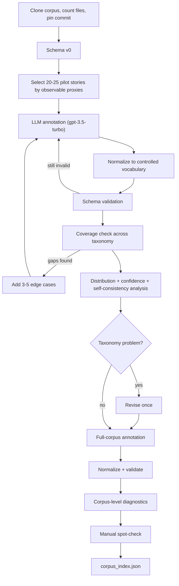

# Metadata Preparation Plan

Scope of this document: **only** how we will design, validate, and produce the corpus metadata (`corpus_index.json`). It intentionally excludes the rest of the system (agents, feedback loops, judge, harness) — see the full project plan for that.

---

## 1. Goal

Produce a per-story metadata index over the local [pb-source](https://github.com/global-asp/pb-source) `/en` corpus that simultaneously serves two purposes:

1. **Agentic search** — lets the Planner retrieve relevant stories as inspiration for a given child request.
2. **Conversation representation** — the same field values represent what the child wants, so extracting from a child's request and annotating a corpus story produce the same shape of object.

```
                        METADATA
                       /        \
                      /          \
             Agentic Search    Conversation
                    |               |
          "Find relevant       "What sounds
             stories"           fun to you?"
```

---

## 2. Data source (context only)

- Corpus: `pb-source/en/*.md` (Pratham Books / StoryWeaver, CC BY 4.0 / Public Domain)
- Exact file count is **not assumed** — `index_corpus.py` establishes it from the actual local clone (approximately in the hundreds per the GitHub listing; do not design around a specific number)
- Each file: `# Title`, `##`-delimited page sections, footer metadata block (`* License:`, `* Text:`, etc.)

---

## 3. Taxonomy v0 — 10 fields

Derived from direct inspection of a diverse cross-section of the actual corpus (not filename-keyword guessing).

| # | Field | Controlled values | Cardinality | Child-facing? |
|---|-------|--------------------|-------------|----------------|
| 1 | `reading_band` | `5-6`, `7-8`, `9-10` | single | Mostly internal |
| 2 | `story_type` | `everyday`, `adventure`, `fantasy`, `mystery`, `folktale`, `discovery/learning`, `bedtime` | multi | Yes |
| 3 | `protagonist_type` | `child`, `animal`, `family/adult`, `personified object/nature`, `group` | single | Yes |
| 4 | `setting` | `home/school`, `city/village`, `nature/farm/jungle`, `travel`, `fantasy/space`, `historical/cultural` | multi | Yes |
| 5 | `interest_tags` | semi-open list (`animals`, `friendship`, `family`, `school`, `science/nature`, `food`, `sports`, `art`, `travel`, `magic`, ...) | multi | Yes |
| 6 | `tone` | `funny`, `warm/cozy`, `exciting`, `wondrous`, `curious`, `mysterious`, `heartfelt` | multi | Yes |
| 7 | `fantasy_level` | `realistic`, `whimsical/personified`, `fully magical` | single | Yes |
| 8 | `plot_shape` | `problem→solution`, `quest/rescue`, `exploration`, `discovery/learning`, `overcome challenge`, `silly/cumulative events` | single | Sometimes |
| 9 | `narrative_style` | `regular prose`, `dialogue-heavy`, `repetitive`, `rhyming/poetic`, `question-and-answer` | multi | Sometimes |
| 10 | `energy_level` | `calm`, `playful`, `exciting`, `mildly tense/spooky` | single | Yes |

Cardinality is stated explicitly because it is not cosmetic: multi-valued fields need a different annotation instruction, and their label counts do not sum to the story count, so validation must normalize per-field rather than assume one label per story.

Plus one non-categorical field stored alongside the ten:

- `summary` — a 2–3 sentence free-text description, used as search text, not a controlled dimension.

**`interest_tags` is semi-open**, not a fixed enum like the other nine — normalize obvious synonyms (`puppy`→`dogs`, `spaceship`→`space`, `soccer`→`football/soccer`) but do not cap it to a closed list.

### 3.1 Escape values: `other` and `uncertain`

Every controlled field additionally accepts two **annotation-only** values:

| Value | Meaning | What high usage diagnoses |
|---|---|---|
| `other` | No defined category reasonably fits | The taxonomy is **missing a category** |
| `uncertain` | A category might fit, but the text does not support a confident choice | Category **definitions are ambiguous**, or the annotation prompt/text is insufficient |

They are kept distinct because they point to different fixes. Confusing them loses the diagnostic entirely.

Without these, the model silently forces each story into the nearest wrong category and the distributions look deceptively clean. With them, the rate becomes real evidence — `plot_shape: other = 2%` is fine, `plot_shape: other = 27%` means the category set is inadequate.

The annotation prompt must state: **use `other` or `uncertain` only when no defined category reasonably fits.** Without that instruction they become an easy default and the labels lose value from the opposite direction.

Two hard constraints on these values:

- **Annotation-only.** They are never valid as a child preference. A child's request can leave a field *unknown*, which is a different thing entirely — unknown means "not yet asked", `uncertain` means "the story text does not tell us".
- **They score as zero, not as wildcards.** In `search_stories`, a story labelled `plot_shape: other` contributes nothing to the `plot_shape` term. It must never be treated as matching every query, which is the natural bug if escape values are handled as "unspecified".

### 3.2 Hard vs. soft dimensions

- **Hard filters** (exclude outright): story is in the licensed/approved corpus; severe safety flags (see below).
- **Soft preferences** (score and rank, never hard-exclude): all 10 fields above.

`language` needs no per-record field or filter — we clone only `/en`, so English is a property of the corpus rather than something to check per story.

**Safety is deliberately not one of the ten fields.** It answers a different question:

```
       search_metadata              safety
     "What do you like?"       "Can we use this?"
              |                        |
         soft scoring            hard eligibility
```

`tone = mildly tense/spooky` is a legitimate *preference* for a 9–10-year-old. Safety is a *system constraint*. Collapsing them into one field would mean a child could never ask for a slightly spooky story without tripping a safety rule, which is the wrong behaviour. Safety therefore lives in its own record block (Section 4).

#### Enforcement is graded, not binary

Retrieved stories are **inspiration for the Planner and are never narrated to the child**, so the safety bar for *retrieval* is lower than the bar for *output*. Hard-excluding every flagged story would discard legitimate structural examples: most `quest/rescue` arcs require a threat, and a large share of folktales would vanish from the corpus entirely.

| Flag | Retrieval effect |
|---|---|
| `disturbing_imagery`, graphic `violence` | Hard-exclude |
| `threat`, `intense_fear`, `death` | Down-weight only |

Output safety remains the **Judge's** responsibility on the generated story, which is the only place it actually matters to the child.

### 3.3 Annotation difficulty and confidence flags

Some fields are usually unambiguous from the text (`protagonist_type`, `setting`, `story_type`); others require real judgment (`plot_shape`, `narrative_style`, `tone`). The annotation prompt asks for a **confidence flag** (`high` / `medium` / `low`) on every field, stored in the `annotation` block, so weak labels are visible during validation.

This is worth more than the label distribution alone. "35% of `plot_shape` labels are low-confidence" is a far stronger signal than a distribution that merely looks plausible.

One caveat to record honestly: self-reported confidence from `gpt-3.5-turbo` is **weakly calibrated**. Treat it as a relative signal of which fields the model finds hard, not as a probability. The self-consistency check in Section 5.3 is the harder evidence.

---

## 4. Record structure

Four blocks per story:

```json
{
  "source": {
    "id": "0056",
    "title": "Goodnight, Tinku!",
    "license": "CC-BY",
    "author": "...",
    "source_file": "0056_goodnight-tinku.md",
    "word_count": 412,
    "corpus_commit": "a1b2c3d"
  },

  "search_metadata": {
    "reading_band": "5-6",
    "story_type": ["bedtime", "adventure"],
    "protagonist_type": "animal",
    "setting": ["nature/farm/jungle"],
    "interest_tags": ["animals", "friendship", "night"],
    "tone": ["warm/cozy", "curious"],
    "fantasy_level": "whimsical/personified",
    "plot_shape": "exploration",
    "narrative_style": ["dialogue-heavy", "repetitive"],
    "energy_level": "calm"
  },

  "summary": "Tinku cannot fall asleep and wanders out into the night, meeting other creatures along the way before settling back down to rest.",

  "safety": {
    "flags": []
  },

  "annotation": {
    "schema_version": "v1",
    "model": "gpt-3.5-turbo",
    "annotated_at": "2026-08-30T23:40:00Z",
    "text_truncated": false,
    "confidence": {
      "reading_band": "medium",
      "story_type": "high",
      "protagonist_type": "high",
      "setting": "high",
      "interest_tags": "medium",
      "tone": "medium",
      "fantasy_level": "high",
      "plot_shape": "medium",
      "narrative_style": "medium",
      "energy_level": "high"
    }
  }
}
```

- `source` — attribution (required for CC BY 4.0 compliance) plus deterministic file facts. Not used in soft scoring.
- `search_metadata` — the shared vocabulary, used both for corpus search and for representing child preferences.
- `summary` — free-text search aid, not a categorical dimension.
- `safety` — eligibility observations, kept out of the taxonomy per Section 3.2.
- `annotation` — provenance and self-reported confidence. Makes validation and re-runs interpretable.

### 4.1 `source` is parsed, never generated

Every field in `source` is extracted deterministically from the Markdown (title heading, footer license/attribution block, filename, word count) — **never produced by the LLM.**

This is not a stylistic preference. `author` and `license` are CC BY 4.0 compliance data, and a hallucinated author name is an attribution failure, not a cosmetic bug. The point matters more given that annotation runs on `gpt-3.5-turbo` (Section 5.6), which is entirely capable of inventing a plausible name. Splitting parsed fields from generated fields also cuts token cost and removes them from the retry path.

`word_count` is free from parsing and genuinely useful: story length matters at bedtime, and `reading_band` is not a substitute for it. `corpus_commit` pins the `pb-source` revision the record was built from, so the shipped index is reproducible.

### 4.2 `bedtime_safe` is derived, not stored

The `safety` block stores **`flags` only.** There is deliberately no `bedtime_safe` boolean in the record.

The reason is that a stored boolean silently commits to one age band. A story in which a grandparent dies may be entirely appropriate at 9–10 and not at 5–6, so a single flag cannot be correct for both. Instead:

```python
# schema.py
def bedtime_safe(flags: list[str], reading_band: str) -> bool:
    ...
```

Flags are **observations** (what is in the text — cheap to annotate, expensive to redo). Eligibility is **policy** (what we allow — cheap to change). Keeping policy in code means revising the safety rule costs a function edit rather than re-annotating several hundred stories through the API.

---

## 5. Annotation and validation pipeline

Principle: **test the taxonomy on the corpus, don't redesign it from scratch.** Schema v0 is already grounded in direct story inspection. A coding agent's role here is to run the pipeline and report distributions — not to invent categories.



### 5.1 Step-by-step

1. **Clone corpus, count files, pin the commit.** Run against the real `/en` folder — do not assume a fixed number. Record the `pb-source` commit hash for `corpus_commit`.

2. **Select 20–25 pilot stories using observable proxies.** We cannot stratify on labels we have not produced yet, so selection uses only what is measurable from raw text *before* annotation:

   | Proxy | Computed from |
   |---|---|
   | Length | Word count |
   | Dialogue-heavy | Quotation-mark density |
   | Rhyming / repetitive | Repeated line endings, repeated n-grams |
   | Animal vs. human protagonist | Animal-noun vs. person-noun presence |
   | Educational / fantasy / everyday | Title keywords |
   | Bias guard | Random sample stratum |

   Two requirements: selection is **computed by script, not eyeballed**, so the pilot is reproducible and reportable; and each pick **records why it was selected**, which is what makes step 4's gap analysis possible. The random stratum matters because keyword-based selection systematically misses stories with uninformative titles.

3. **Annotate the pilot batch.** One LLM call per story against schema v0, requesting `search_metadata`, `summary`, `safety.flags`, and per-field confidence. `source` fields are parsed separately (Section 4.1) and never requested from the model.

4. **Normalize, then validate.** Order matters and is the reverse of the intuitive one — see Section 5.2.

5. **Coverage check.** Now that labels exist, check whether the pilot actually spans the taxonomy. If a field has values no pilot story exercises, deliberately add 3–5 edge cases and annotate those too. This is why the pilot is 20–25 rather than exactly 20: the second stage is expected, not a contingency.

6. **Diagnostics.** Per-field distributions, `other`/`uncertain` rates, confidence distributions, and the self-consistency check (Section 5.3). Evaluate against the checklist in Section 5.4.

7. **Decision point.**
   - No failure signal → lock schema v0 as v1, unchanged.
   - Concrete failure → revise **once** (merge sparse values, split an overloaded value, tighten the annotation prompt), then re-run the pilot check before proceeding.

8. **Annotate the full corpus** with schema v1 — a one-time offline batch job, resumable (Section 5.5).

9. **Normalize, validate, and re-run corpus-level diagnostics** across the full corpus rather than only the pilot.

10. **Manual spot-check** a handful of entries not seen during the pilot.

11. **Ship `corpus_index.json`** as a static, versioned artifact — never regenerated at runtime.

### 5.2 Normalize before validating

The deterministic step between the LLM call and saving is:

```
LLM annotation  ->  normalize  ->  schema validation  ->  save
                                        |
                                   still invalid
                                        |
                                    re-annotate
```

**Normalization runs first.** This is the opposite of the intuitive ordering, and the reason is concrete: if validation runs first, a perfectly recoverable `"Warm"` is rejected as a schema violation and burns an API retry on something a dictionary lookup fixes for free. Normalize first, and validation only catches genuine failures.

Examples of what normalization absorbs:

```
"Warm"          -> "warm/cozy"
"whimsical"     -> "whimsical/personified"
"space travel"  -> interest tag "space"
"puppy"         -> "dogs"
"soccer"        -> "football/soccer"
```

Do not rely on the model to follow the controlled vocabulary perfectly every time — it will not, and that is a normal, cheap-to-handle failure rather than something to fix with prompt engineering.

Two implementation requirements:

- **The synonym map lives in `schema.py`**, alongside the vocabularies it maps into, and is imported by *both* corpus annotation and runtime child-request extraction. This is load-bearing: Section 1 claims that annotating a story and extracting from a child's request produce the same shape of object, and that claim is **false** if normalization is applied on only one side. `"puppy"` from a child must land on the same tag as `"puppy"` in a story.
- **Log every normalization applied.** How often the model deviates from the vocabulary is itself a signal about prompt quality, and it is free to collect.

### 5.3 Self-consistency check

Re-annotate about 5 pilot stories a second time and compare the labels.

A field whose value flips between identical runs is **noisy regardless of how healthy its distribution looks** — a clean-looking `plot_shape` distribution means nothing if the same story gets `exploration` on one pass and `quest/rescue` on the next. Distribution analysis cannot detect this, which is why it is a separate check.

This matters more here than it would with a stronger model, since annotation is pinned to `gpt-3.5-turbo` (Section 5.6), and it is the harder evidence that self-reported confidence (Section 3.3) is not.

### 5.4 Validation checklist (applies at both pilot and full-corpus stages)

- [ ] Fields with >90% dominance are **flagged for inspection** — see below, this is a warning and not a failure
- [ ] `other` rate is low across all fields (high rate → missing category)
- [ ] `uncertain` rate is low across all fields (high rate → ambiguous definitions)
- [ ] No field exceeds ~30% low-confidence labels
- [ ] Self-consistency: repeat annotations agree on single-valued fields
- [ ] `tone` and `energy_level` are not redundant — pre-registered hypothesis, see below
- [ ] No other pair of fields is fully redundant
- [ ] `interest_tags` shows reasonable diversity, not a handful of repeated tags
- [ ] Spot-checked entries look correct on manual read
- [ ] `source` block populated for every entry (attribution completeness)

**Dominance is a warning, not a failure.** If the corpus genuinely consists mostly of simple stories, then `reading_band: 5-6 = 91%` is a *fact about the corpus*, not a defect in the taxonomy. The same applies to `energy_level`. A field is only actually problematic when it is dominant **and** contributes little retrieval discrimination.

That second condition needs to be runnable rather than a judgment call:

> For any field exceeding 90% dominance, drop it from the scoring function and re-run ~20 sample child requests. If the top-3 results never change, the field is not earning its weight.

**`tone` / `energy_level` redundancy is pre-registered** as a specific hypothesis rather than left to a generic redundancy sweep. These two are the most likely pair to collapse into each other (calm/warm, exciting/exciting), so the check is stated in advance and looked for deliberately.

### 5.5 Resumable runs

Cache annotation results per story on disk, keyed by story ID and schema version, so a re-run skips completed work.

This is not optional polish. Several hundred sequential API calls will hit rate limits, transient failures, and malformed responses; without caching, one failure two-thirds of the way through means paying for the whole batch again. Partial caches are gitignored.

### 5.6 Annotation uses the assignment's required model

Corpus annotation uses **`gpt-3.5-turbo`** — the same model the runtime agents use, as required by the README.

The README's constraint is arguably about the storytelling pipeline rather than offline data prep, but honoring it is the conservative reading and costs nothing. It yields an unambiguous account:

> The same required model powers both offline metadata annotation and the runtime agents; the metadata is simply precomputed and versioned.

No question of a stronger model having been used offline to create an advantage.

Two consequences follow directly, and both are already handled above:

- **The context window is a real constraint** (Section 5.7), not something we can defer.
- **Judgment-heavy fields will be weaker.** Expect higher `uncertain` rates on `plot_shape`, `narrative_style`, and `tone`. This is why the self-consistency check (Section 5.3) matters and why confidence flags are collected at all.

### 5.7 Long stories

Some corpus files are large enough that a single `gpt-3.5-turbo` pass cannot hold them. Since the model choice is fixed, this needs an explicit rule rather than a silent truncation.

**Measure the length distribution first.** If only a handful of stories exceed the window, the special case stays small and cheap.

For files that do exceed it, use **head-plus-tail sampling**: roughly the first 60% and last 20% of the text, with the elision explicitly marked in the prompt. Naive head-only truncation is actively harmful here because it removes exactly the evidence the ending-dependent fields need — `plot_shape` resolution, `energy_level`, and whether the story closes calm, which is the single most important property for bedtime.

Any record built from sampled text sets **`text_truncated: true`**, so validation can tell whether a weak label came from a weak model or from incomplete text.

---

## 6. Tooling to build

| File | Purpose |
|------|---------|
| `schema.py` | Single source of truth: field definitions, controlled values, cardinality, escape values, the **synonym/normalization map**, and `bedtime_safe(flags, reading_band)`. Imported by the annotation scripts *and* by runtime child-request extraction |
| `annotate_corpus.py` | Runs the LLM annotation call against a given list of story files; pilot-batch and full-batch modes; owns the resumable per-story cache and long-story head-plus-tail sampling |
| `select_pilot.py` | Computes the observable proxies from Section 5.1 and selects the 20–25 pilot stories, recording the selection reason per story |
| `validate_taxonomy.py` | Per-field distributions, `other`/`uncertain` rates, confidence distributions, self-consistency comparison, pairwise redundancy checks, and the drop-a-field retrieval discrimination test; prints checklist results |
| `index_corpus.py` | Orchestrates: count files and pin commit → parse `source` fields → run pilot → (pause for manual revision) → full batch → normalize → validate → write `corpus_index.json` |
| `corpus_index.json` | Generated output — one record per story, per the structure in Section 4 |

Normalization is deliberately **not** a separate `normalize_metadata.py`. It belongs in `schema.py` because it maps *into* the controlled vocabularies defined there, and because it must be callable from the runtime extraction path as well as the offline annotation path (Section 5.2). A standalone module would invite a second, divergent copy of the synonym map — which is exactly the failure that breaks the shared-vocabulary claim in Section 1.

---

## 7. Out of scope for this document

Everything about *using* this metadata once built — search scoring, question-asking strategy, arc profiles, Planner/Judge behavior — belongs to the main project plan, not here.
