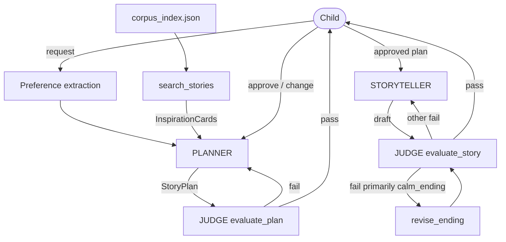

# Bedtime Story for Kids

A child-facing bedtime storyteller for ages 5–10, built for the
[Hippocratic AI](https://www.hippocraticai.com) coding assignment.

The child asks for a story, helps shape a short concept, and hears a finished
tale. Under the hood: a Planner, a Storyteller, a hybrid Judge, and a
metadata-indexed children's corpus for structural inspiration.

**Do not change the OpenAI model** (`gpt-3.5-turbo`). Use your own API key;
never commit it.

---

## Quick start

```bash
python3 -m venv .venv
source .venv/bin/activate          # Windows: .venv\Scripts\activate
pip install -r requirements.txt
cp .env.example .env               # then put your OpenAI key in .env
python main.py
```

`corpus_index.json` (388 annotated stories) ships with the repo. Rebuild it
only if you re-run the offline annotation pipeline (see
[`METADATA_PREPARATION_PLAN.md`](./METADATA_PREPARATION_PLAN.md)).

Unit tests (no API key required):

```bash
python test_schema.py && python test_loop1.py && python test_loop2.py
```

Scripted end-to-end smoke tests (uses the API):

```bash
python smoke_e2e.py
```

---

## Browser UI (optional)

The default way to run the system is still the terminal CLI:

```bash
python main.py
```

If you prefer a simple local browser interface for demos:

```bash
pip install -r requirements.txt   # includes streamlit
streamlit run app.py
```

Streamlit opens a local page in your browser. You still need your own
`OPENAI_API_KEY` in `.env` (same as the CLI). The UI is only a thin wrapper
around the existing Loop 1 / Loop 2 agents — it does not change generation,
judging, or retrieval behavior.

---

## What the child sees

```
How old are you? (or press Enter to skip) 7
What kind of story do you want to hear? a brave little mouse in a thunderstorm

Here's an idea for your story:

  Pip the mouse is scared of thunder, until her friends help her listen
  for the soft rain that comes after...

  Should Pip's friend be a robin or a firefly?

What do you think? yes!

Okay — here is your story.

  Once upon a time...
  ...

Did you like it? (say yes, or tell me what to change) yes
The end. Sweet dreams!
```

The child never sees Judge scores, JSON, revision counts, or agent names.
Errors degrade to a short apology, not a stack trace.

---

## Architecture

Three agents, one shared `SessionContext`, two nested feedback loops.
Design detail: [`REPORT.md`](./REPORT.md).



### Loop 1 — brainstorm the idea

Cheap and fast. The Planner proposes a short concept; the Judge checks it
(internally, invisible to the child); the child reacts. Most alignment
happens here so Loop 2 is not wasted regenerating full prose.

### Loop 2 — write and refine the story

After the concept is approved, the Storyteller writes the full story
(whole-story generation by default). The Story Judge checks it before the
child hears anything. If the only failure is `calm_ending`, a targeted
ending repair rewrites just the closing section; broader failures still
regenerate the whole draft.

---

## Corpus search

Offline, every story in [`global-asp/pb-source`](https://github.com/global-asp/pb-source)
(`/en`) is annotated with a shared ten-field taxonomy (`schema.py`). At
runtime, `story_search` hard-filters on language/license and soft-scores the
rest. Hits become `InspirationCard`s — summary + structure only, **never**
full prose — so the Planner borrows pacing ideas without copying published
text.

Safety flags are soft ranking signals only; the storytelling Judge is the
real safety gate on generated output.

---

## Hybrid Judge

Code decides pass/fail, not the model alone:

- **Deterministic checks** — `must_include` present (word-boundary match),
  word-count band, no leaked meta-text, valid `plot_shape`.
- **LLM-scored dimensions** (1–5 with a required reason each) — engagement,
  coherence, warmth, age-appropriateness; for stories also `calm_ending` and
  `preference_adherence` (stricter bar).

`UserPreferences` is passed to the Judge every round so a request made in
Loop 1 cannot silently disappear in Loop 2.

---

## Evidence-driven generation choices

**Whole-story vs. beat-by-beat.** A paired A/B (9 plans × 2 strategies × 2
repeats = 36 runs) found no practically meaningful quality difference (all
six Judge dimensions differed by ≤0.05), while beat-by-beat cost ~3× the LLM
calls and was about twice as repetitive. Whole-story is the production
default. Details: [`artifacts/ab_experiment/report.md`](./artifacts/ab_experiment/report.md).

**Targeted calm-ending repair.** The persistent failure mode was landing a
calm ending after high-energy arcs — independent of generation granularity.
`revise_ending` fires only when `calm_ending` is the primary failure;
broader failures stay on full regeneration. Details:
[`artifacts/ending_repair/report.md`](./artifacts/ending_repair/report.md).

---

## Project layout (runtime)

| File | Role |
|---|---|
| `main.py` | Child-facing entry point |
| `session_runner.py` | Loop 1 → Loop 2 orchestration |
| `loop1.py` / `loop2.py` | Plan brainstorm / story write |
| `planner.py` / `storyteller.py` / `judge.py` | The three agents |
| `harness.py` | Shared Agent↔Judge↔child revision loop |
| `story_search.py` / `inspiration.py` | Corpus retrieval → InspirationCards |
| `schema.py` / `corpus_index.json` | Taxonomy + annotated index |
| `REPORT.md` | Full design write-up |

Offline annotation tooling (`annotate_corpus.py`, `index_corpus.py`, …) is
documented in [`METADATA_PREPARATION_PLAN.md`](./METADATA_PREPARATION_PLAN.md).

---

## Assignment notes

- Model is fixed at `gpt-3.5-turbo`.
- Put your key in `.env` (gitignored). Never commit it.
- Original evaluation criteria and FAQs from the assignment skeleton are
  preserved in spirit above; the design rationale lives in `REPORT.md`.
