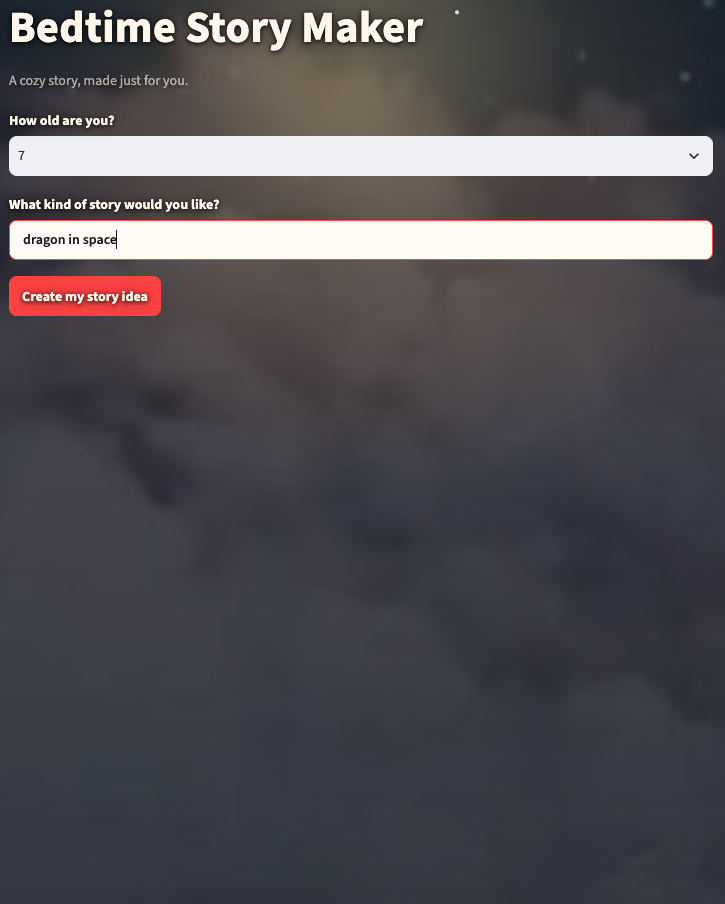
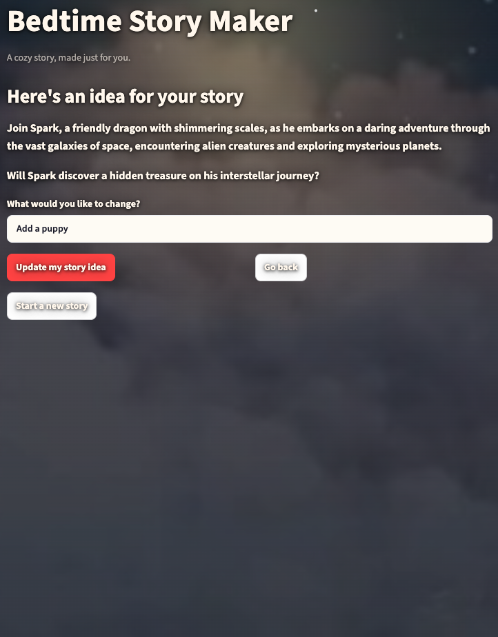
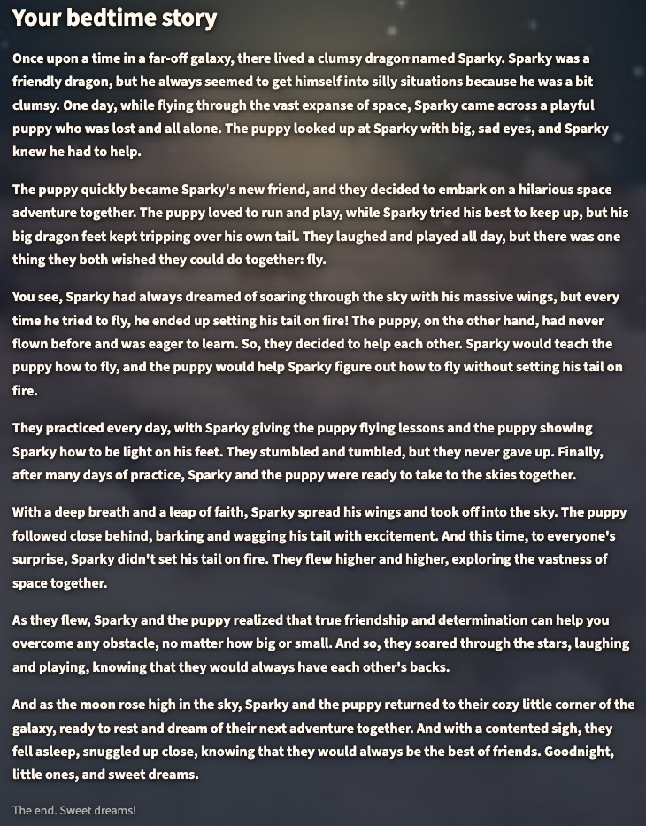
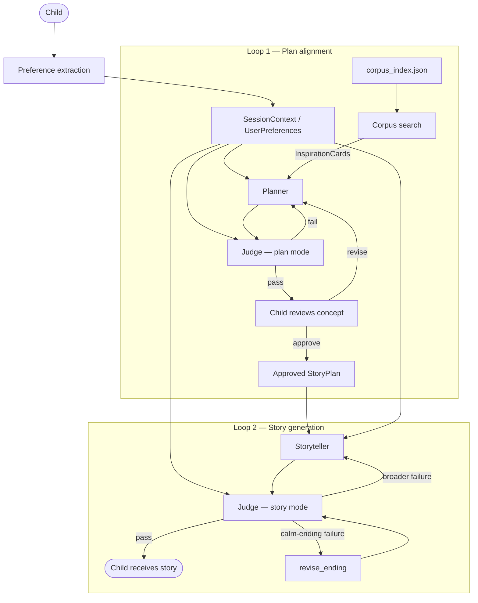

# 🌙 Bedtime Story Maker

An evaluated agentic AI system for personalized generation, built around explicit state, bounded agent loops, retrieval-grounded planning, and hybrid LLM/deterministic evaluation.

Planner–Judge–Storyteller orchestration and targeted failure repair.

**🚀 Live Demo — deploying soon** · **[🏗 Architecture](#architecture)** · **[🧪 Evaluation](#evaluation)** · **[⚙️ Run locally](#try-it-locally)**

| 388-story corpus | 49 test groups passing | 36-run generation A/B |
|---|---|---|
| ~3.1× fewer LLM calls (chosen strategy) | conditional ending repair | metadata-grounded retrieval |

---

## Product preview

<p align="center">
  
  
  
</p>

<p align="center"><em>Story idea → concept review → final story</em></p>

The Streamlit UI is a demo layer over the same Planner / Judge / Storyteller pipeline as the CLI. After deployment, the Live Demo link above will point to the hosted URL.

---

## Engineering highlights

| Engineering problem | Design decision |
|---|---|
| User intent drifts across generations | Durable `UserPreferences` + behavioral/thematic requests (`explicit_asks`) supplied to every Planner and Judge call |
| Exact requirements are unreliable when judged semantically alone | Hybrid Judge: deterministic checks + LLM-scored dimensions |
| Agent loops can run indefinitely | Bounded revision loop (hard retry limit) with best-effort fallback after the retry limit |
| Corpus grounding should inspire, not copy source prose | Compact retrieved metadata summary (`InspirationCard`s) — structure only, never full source prose |
| More decomposition might improve a weaker model | Implemented and measured whole-story vs beat-by-beat strategies |
| Recurring calm-ending failures on high-energy arcs | Conditional `revise_ending` — closing section only, not a new agent |
| Safety-driven adaptation can look like model failure | Transparent constraint adaptation with a child-facing explanation (`child_notice`) |

---

## Architecture

Three agents, one shared session-state object (`SessionContext`), and two bounded feedback loops. Full design rationale: [`REPORT.md`](REPORT.md).



Plan mode and story mode use the same Judge implementation with different evaluation rubrics.

**Loop 1** aligns the story concept before spending full-generation calls. **Loop 2** generates and evaluates the full story only after plan approval.

---

## How it works

1. **Child gives an idea** — age band and free-text request.
2. **Preferences are extracted** — entities → required entities (`must_include`); behavioral/thematic requests → `explicit_asks`.
3. **Planner retrieves inspiration and drafts a structured story plan (`StoryPlan`)** — corpus search returns InspirationCards; Planner selects a high-level plot structure (`plot_shape`) and its story-arc steps (beats).
4. **Judge — plan mode evaluates** — hybrid checks in a bounded revision loop before the child sees anything.
5. **Child approves or revises the concept** — feedback normalized and accumulated into `UserPreferences`.
6. **Storyteller writes; Judge — story mode validates** — full story generated and checked; conditional ending repair if the calm bedtime ending is the primary failure.

---

## Shared state and contracts

This is not a single chained prompt. Components exchange explicit structured state:

| Object | Role |
|---|---|
| `SessionContext` | Shared structured session state across both loops |
| `UserPreferences` | Accumulated child intent — entities, tone, themes |
| `must_include` | Concrete required entities explicitly requested by the child (deterministically checked) |
| `explicit_asks` | Behavioral/thematic requests persisted separately from entities |
| `StoryPlan` | Structured, approved plan passed from Loop 1 to Loop 2 |
| `JudgeResult` | Structured Judge output with per-dimension scores and reasons |

Loop 1 aligns *what* the child wants before Loop 2 spends full-generation calls on *how* to tell it.

---

## Hybrid evaluation

**Principle:** use deterministic checks for what code can know exactly; use the LLM Judge for semantic qualities.

| Deterministic (code) | LLM Judge (semantic) |
|---|---|
| Required entities present (`must_include`, word-boundary phrase match) | Engagement, coherence, warmth |
| Word-count band | Age appropriateness |
| Valid high-level plot structure (`plot_shape`) | Preference adherence |
| No leaked internal instructions / agent commentary | Calm bedtime ending (`calm_ending`) |

Pass/fail is decided in code from combined signals — the model scores and explains, but does not unilaterally decide.

---

## Engineering tradeoffs

**Whole-story** generates the complete draft in one generation call per attempt. **Beat-by-beat** generates each story-arc step sequentially, passing the story-so-far into the next call.

Both strategies were implemented and compared on the same nine hand-built plans, two repeats each (**36 real API runs**). Details: [`artifacts/ab_experiment/report.md`](artifacts/ab_experiment/report.md).

| Metric | Whole-story | Beat-by-beat |
|---|---|---|
| Pass rate | **83.3%** (15/18) | 88.9% (16/18) |
| LLM calls / run | **3.22** | 9.94 |
| Latency | **9.95s** | 16.33s |
| Average words | **386** | 587 |
| Repetition density | **0.0097** | 0.0199 |

Beat-by-beat achieved a small pass-rate advantage but required **~3.1×** more LLM calls, **~1.6×** latency, greater length, and roughly **2×** repetition. Whole-story was retained as the system default — evidence-driven simplification, not premature optimization.

---

## Failure analysis and targeted repair

| Stage | Finding |
|---|---|
| **Observed** | Calm bedtime ending repeatedly failed on high-energy / silly-cumulative arcs |
| **Hypothesis tested** | Finer beat-by-beat generation might fix landing problems |
| **Evidence** | Both strategies failed the same hard plan (4/4 on plan 06) — strategy-independent |
| **Diagnosis** | Semantic ending problem, not a context-length or story-splitting problem |
| **Response** | `revise_ending` — a Storyteller *operation*, not a new agent — rewrites only the closing ~25% when calm ending is the primary failure |

Directional Loop 2 evidence on the hard case: **2/3 pass** with ending repair vs **1/3** with full regeneration only; lower mean attempts and latency. Details: [`artifacts/ending_repair/report.md`](artifacts/ending_repair/report.md).

Broader story failures still trigger a full rewrite. Safety-driven adaptations that materially change explicit child intent surface as a child-facing explanation (`child_notice`); ordinary revisions do not.

---

## Reliability by design

- Structured outputs with defensive JSON parsing, validation, and retry handling
- Custom bounded Agent↔Judge harness rather than framework-managed orchestration
- Bounded internal Planner↔Judge and Storyteller↔Judge loops
- Explicit shared session state — preferences do not rely on conversational memory
- Deterministic enforcement where semantics are unnecessary
- Best-effort fallback after the retry limit instead of unbounded regeneration
- Child-facing errors instead of traces, scores, or agent names
- **49 automated test groups passing** (no API key required)
- Real API validation via `smoke_e2e.py` (five scripted end-to-end scenarios) and targeted demo scripts

---

## Evaluation

| Layer | What it covers |
|---|---|
| **Unit tests** | **49 test groups passing** across `test_loop1.py` (23), `test_loop2.py` (13), `test_schema.py` (13) |
| **Scripted smoke tests** | `smoke_e2e.py` — five end-to-end scenarios across age bands |
| **Real API validation** | `demo_loop1.py`, `demo_loop1_targeted.py`, `demo_e2e.py` |
| **A/B experiment** | [`artifacts/ab_experiment/report.md`](artifacts/ab_experiment/report.md) |
| **Ending repair study** | [`artifacts/ending_repair/report.md`](artifacts/ending_repair/report.md) |

```bash
python test_schema.py && python test_loop1.py && python test_loop2.py
```

---

## Try it locally

### Browser UI (recommended for demos)

```bash
python3 -m venv .venv
source .venv/bin/activate          # Windows: .venv\Scripts\activate
pip install -r requirements.txt
cp .env.example .env               # add your OpenAI key — never commit it
streamlit run app.py
```

### CLI

```bash
python main.py
```

`corpus_index.json` (388 annotated stories) ships with the repo. Rebuild only if re-running the offline annotation pipeline — see [`METADATA_PREPARATION_PLAN.md`](METADATA_PREPARATION_PLAN.md).

Provide your own `OPENAI_API_KEY` in `.env`; it is never included in this repository.

---

## Project structure

| Path | Role |
|---|---|
| `app.py` | Optional Streamlit UI |
| `main.py` | Child-facing CLI entry point |
| `session_runner.py` | Loop 1 → Loop 2 orchestration |
| `loop1.py` / `loop2.py` | Plan brainstorm / story write |
| `planner.py` / `storyteller.py` / `judge.py` | The three agents |
| `harness.py` | Shared Agent ↔ Judge revision loop |
| `story_search.py` / `inspiration.py` | Metadata retrieval → inspiration cards |
| `preference_extractor.py` / `feedback_normalizer.py` | Child input → structured preferences |
| `schema.py` / `corpus_index.json` | Shared taxonomy + annotated index |
| `assets/` | UI assets and product screenshots |
| `REPORT.md` | Full system design write-up |

---

## Deep dive

- [`REPORT.md`](REPORT.md) — agents, loops, Judge rubric, harness design
- [`artifacts/ab_experiment/report.md`](artifacts/ab_experiment/report.md) — generation strategy comparison
- [`artifacts/ending_repair/report.md`](artifacts/ending_repair/report.md) — targeted calm-ending repair
- [`METADATA_PREPARATION_PLAN.md`](METADATA_PREPARATION_PLAN.md) — corpus annotation and index build

---

## Corpus and attribution

Story structure inspiration comes from the [StoryWeaver / Pratham Books `pb-source`](https://github.com/global-asp/pb-source) English corpus (CC BY 4.0 / Public Domain). Stories were **not** written for this project — we annotate metadata and retrieve structural patterns only; generated prose is original.

---

## Project origin

This project began as an open-ended coding challenge with constraints including ages 5–10, an LLM Judge, and a fixed `gpt-3.5-turbo` model. It was developed further into a general agentic-AI system with measured engineering trade-offs and evidence-backed design choices. The original prompt came from [Hippocratic AI](https://www.hippocraticai.com).
