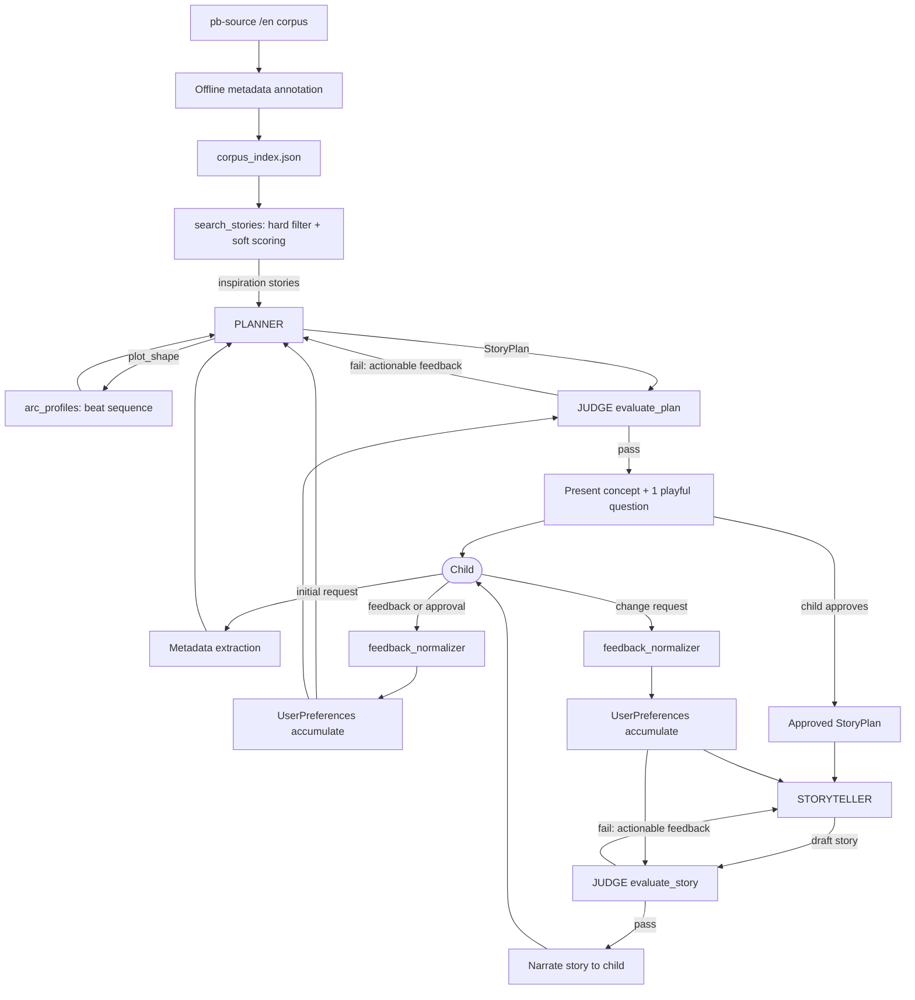
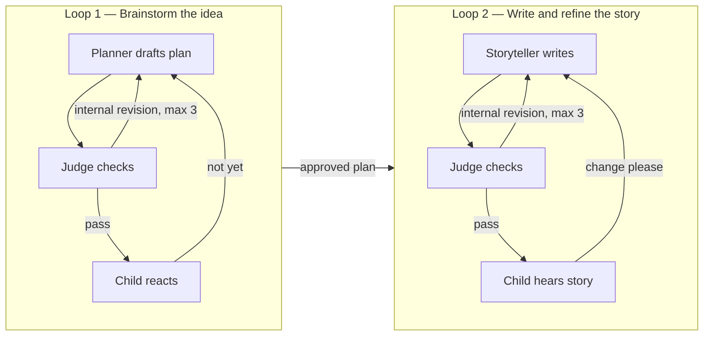

# Bedtime Story System — Design Report

Design document for the Hippocratic AI bedtime-story assignment.

Scope note: this report covers the **system** — agents, feedback loops, judge, harness, corpus search, and story arcs. It deliberately does *not* restate how the corpus metadata is designed and produced; that lives in [`METADATA_PREPARATION_PLAN.md`](./METADATA_PREPARATION_PLAN.md).

---

## 1. Problem framing

The assignment asks for a script that takes "any simple bedtime story request" and produces a story appropriate for ages 5–10, with an LLM judge improving quality and a block diagram of the flow.

The skeleton in `main.py` does the naive thing:

```python
user_input = input("What kind of story do you want to hear? ")
response = call_model(user_input)
print(response)
```

One prompt, one shot, no structure, no quality control, no arc, no interaction. Everything below is motivated by a specific weakness of that baseline.

### 1.1 The constraint that shapes the design

`gpt-3.5-turbo` is fixed — the README forbids changing it. This matters more than it first appears. A weaker model means:

- We cannot rely on a single mega-prompt to hold plot coherence, age-appropriate vocabulary, arc structure, and the child's accumulated preferences all at once.
- **Decomposition is not architectural decoration; it is the only way to get quality out of this model.** Each call gets one job and a small context.
- Structured output needs defensive parsing. `gpt-3.5-turbo` will occasionally emit prose around JSON, so JSON handling must retry rather than crash.

### 1.2 The reframing that mattered most

The user is a **child aged 5–10**, not an editor. An early version of this design assumed adult-style feedback ("give Bob more dialogue"). That is wrong. A seven-year-old says "I want a dragon!" or "that's boring" or just "yes!".

Consequences that ripple through the whole system:

- Feedback is short, vague, enthusiastic, and often not actionable as literal instruction. It needs interpretation before an agent can act on it.
- We must never show the child a form, a menu of ten fields, or vocabulary like "narrative style" or "cumulative structure".
- Errors, retries, and judge rejections must be invisible. The child should never see a traceback or the words "attempt 3 failed".

---

## 2. Architecture overview

Three agents, one shared state object, and two nested feedback loops.

| Component | Job |
|---|---|
| **Planner** | Turn a child's request into a structured `StoryPlan`. Searches the corpus for inspiration, picks an arc profile, decides what to ask the child next. |
| **Storyteller** | Turn an approved `StoryPlan` into prose. Generates the whole story in one call (§10 resolves this against a beat-by-beat alternative, measured and rejected). |
| **Judge** | Two modes: `evaluate_plan` and `evaluate_story`. Scores against a rubric *and* against the child's accumulated preferences. |
| **SessionContext** | Single source of truth: preferences, approved plan, feedback history, trace log. |

### 2.1 Block diagram



Two things in this diagram are worth calling out explicitly, because they are the design's main claims.

**First, feedback reaches both the agent and the judge.** When the child says "make it funnier", the Planner needs it to revise, but the Judge needs it to *enforce* it. Without that second edge, the Judge would happily pass a revision that quietly dropped the child's earlier request. This makes the Judge a preference-enforcement layer, not just a quality gate.

**Second, the corpus feeds the Planner, never the child.** Retrieved stories are structural inspiration — never narrated verbatim, never reproduced. This keeps us clear of both the licensing question and the plagiarism question.

### 2.2 The two loops



Loop 1 is cheap and fast: the child iterates on a two-sentence concept, not a 900-word story. This is where most of the alignment happens, and it is far less frustrating than regenerating full stories.

Loop 2 is expensive, so it runs only after the concept is agreed. Judge-driven internal revision happens *before* the child ever hears the story, so the child sees drafts that already cleared the quality bar.

---

## 3. Story arcs

The README suggests using story arcs. The obvious implementation is a single canonical arc — Hook, Characters, Problem, Rising Action, Climax, Resolution, Cozy Ending — applied to every story. That is a mistake: it forces a quiet "where does the sun go at night?" wonder story through the same skeleton as a dragon rescue.

Instead, **`plot_shape` selects an arc profile.** The same taxonomy field that drives corpus retrieval also drives generation structure, which means retrieval and story structure are coupled rather than unrelated subsystems.

```python
ARC_PROFILES = {
    "problem_solution":   ["Hook", "Problem", "Attempt", "Solution", "Warm ending"],
    "quest_rescue":       ["Hook", "Goal", "Departure", "Obstacles", "Climax", "Return", "Resolution"],
    "exploration":        ["Hook", "Departure", "Encounter 1", "Encounter 2", "Encounter 3", "Discovery", "Return"],
    "discovery_learning": ["Question", "Guess 1", "Guess 2", "Imaginative possibility", "Explanation", "Satisfying close"],
    "overcome_challenge": ["Hook", "Challenge", "Setback", "Effort", "Breakthrough", "Warm ending"],
    "silly_cumulative":   ["Hook", "Silly event 1", "Silly event 2", "Silly escalation", "Peak silliness", "Calm resolution"],
}
```

These are **guidance, not templates**. The Planner may deviate; the profile shapes the beat list it drafts and gives the Judge something concrete to check coherence against.

Two arc rules are non-negotiable regardless of profile, and both are deterministic code checks rather than LLM judgment:

- Every profile ends calm. This is a *bedtime* story, so an unresolved cliffhanger or a high-energy finish is a functional failure, not a stylistic one.
- Beat count scales with `reading_band` — fewer, shorter beats for ages 5–6.

Whether to *generate* beat-by-beat (rather than write the whole story in one call) was an open question at this point in the design; §10 measures both and resolves it in favor of whole-story generation. `arc_beats` still exists and is still used — as the Storyteller's structural guidance within a single prompt, and as the Judge's `arc_coherence` reference — just not as a per-beat call boundary.

---

## 4. Grounding in a real story corpus

### 4.1 Why a corpus at all

Without grounding, `gpt-3.5-turbo` produces competent but generic children's prose — the same cheerful narrator voice, the same tidy moral, the same rhythm every time. Real children's books are more varied: some rhyme, some are built on repetition, some are almost entirely dialogue, some are structured as a chain of questions.

The corpus supplies **narrative patterns**, retrieved as inspiration for the Planner.

### 4.2 Source

[`global-asp/pb-source`](https://github.com/global-asp/pb-source), English subset — Pratham Books / StoryWeaver stories in Markdown, CC BY 4.0 or public domain with per-story license metadata.

Why this and not alternatives:

- Genuine children's literature, not synthetic LLM output.
- Open-licensed with machine-readable per-story attribution, which satisfies the assignment's "no unlicensed code/resources" rule.
- Plain Markdown, trivially searchable with no vector DB or embedding service.
- Can be cloned locally, so retrieval is deterministic and the submission is self-contained. We deliberately do **not** depend on live StoryWeaver search.

An honest caveat, stated because it is easy to overclaim: this corpus gives us texts and licenses, but **no evidence that specific stories were liked by 5–10-year-olds.** It is a *curated, age-oriented children's-literature corpus*, not a set of "proven popular stories". Engagement signals would require a second, separate metadata source.

Corpus size is established by `index_corpus.py` against the actual clone rather than assumed. The GitHub listing runs well past ID 0400 with gaps, so counts in the several hundreds are plausible; nothing in the design depends on the exact figure.

### 4.3 Retrieval: hard filters, soft scoring

The key retrieval insight is that a child's request should **rank** the corpus, not filter it to nothing. "Cat + space + funny" must not mean `cat AND space AND funny AND fantasy AND quest` — over a few-hundred-story corpus that returns zero results almost every time.

**Hard constraints** (exclude outright): English, in the licensed corpus.

**Soft preferences** (score and rank, never exclude): all ten taxonomy fields.

```python
score = (
    3.0 * interest_match
    + 2.0 * story_type_match
    + 2.0 * protagonist_match
    + 1.5 * setting_match
    + 1.5 * tone_match
    + 1.0 * fantasy_match
    + 1.0 * plot_shape_match
    + 0.5 * narrative_style_match
    + 0.5 * energy_match
)
```

The weights are hand-set and defensible rather than tuned — `interest_tags` dominates because that is what the child actually said out loud, and `narrative_style`/`energy_level` are lowest because they are the fields the Planner can reasonably choose on its own. The ranking interpretation is "how much useful evidence does this story offer for the request", which degrades gracefully: a weird request still returns the three most structurally relevant stories instead of nothing.

The taxonomy itself, its controlled values, and how the index is produced and validated are all specified in [`METADATA_PREPARATION_PLAN.md`](./METADATA_PREPARATION_PLAN.md).

---

## 5. Talking to the child

### 5.1 Ten fields is a search space, not a questionnaire

The taxonomy has ten fields. The child must never be asked ten questions.

Suppose the child says: *"I want a funny story about a dragon and a little girl flying to the moon."*

We can already infer most of it:

```json
{
  "story_type": ["adventure", "fantasy"],
  "protagonist_type": ["child", "fantastical creature"],
  "setting": ["fantasy/space"],
  "interest_tags": ["dragon", "moon", "flying"],
  "tone": ["funny"],
  "fantasy_level": "fully magical"
}
```

Asking "what narrative style would you like?" at this point would be absurd. A seven-year-old should not be choosing between "dialogue-heavy" and "cumulative structure".

So the fields split by who resolves them:

| Child-preference heavy | Mostly Planner-selected |
|---|---|
| `story_type` | `plot_shape` |
| `protagonist_type` | `narrative_style` |
| `setting` | `reading_band` |
| `interest_tags` | most of `energy_level` |
| `tone` | |
| `fantasy_level` | |

Unresolved fields are chosen by the Planner using the retrieved examples — which is precisely what the corpus is for.

### 5.2 Choose the next *question*, not the next empty field

The naive loop is:

```python
for field in missing_fields:      # do not do this
    ask_child(field)
```

That is form-filling. Instead, the Planner asks: **which single question would most change the direction of this story?**

Given the dragon/moon request, `setting` is already settled, so asking about it is wasted. But "Should the dragon be silly, friendly, or mysterious?" genuinely forks the story. The selection is driven by what is already known, how uncertain the remaining fields are, and what the corpus can actually support.

Budget: **1–3 questions, always phrased playfully, always offering concrete options** rather than open-ended prompts. Concrete options matter — "what tone do you want?" stalls a six-year-old, while "silly, friendly, or mysterious?" is answerable.

### 5.3 Interpreting what comes back

Child feedback is not structured, so `feedback_normalizer` maps free text to intent before any agent sees it:

```python
@dataclass
class ChildResponse:
    approved: bool
    raw_text: str
    intent: Literal["approve", "new_idea", "more_fun", "too_long",
                    "too_scary", "add_element", "other"]
    extracted_element: str | None   # "dragon" from "I want a dragon!"
```

This is what lets "I want a dragon!" become a durable constraint rather than a one-off instruction — and, crucially, lets the Judge verify in later rounds that the dragon is still there.

### 5.4 Preferences accumulate

`UserPreferences` holds the initial request, every round of plan feedback, the approved plan, and every round of story feedback. It is passed to the Planner, the Storyteller, *and* the Judge.

This solves the failure mode that makes naive revision loops feel broken to a user: the child asks for a dragon in round 1 and "funnier" in round 2, and the round-2 revision silently drops the dragon. Because the Judge sees the full accumulated preference set, that regression fails the check and gets fixed before the child ever hears it.

---

## 6. The agent harness

Rather than hand-writing two near-identical revision loops, the Agent↔Judge cycle is factored into one reusable component.

```python
class AgentLoop:
    def run(
        self,
        agent_fn,          # () -> artifact
        judge_fn,          # (artifact) -> Verdict
        present_fn,        # (artifact) -> show to child
        collect_fn,        # () -> ChildResponse
        session: SessionContext,
        max_internal: int = 3,
        max_child_rounds: int = 5,
    ):
        child_rounds = 0
        while child_rounds < max_child_rounds:
            artifact = self._internal_loop(agent_fn, judge_fn, max_internal, session)
            response = present_fn(artifact)
            if response.approved:
                return artifact
            session.add_child_feedback(response)
            child_rounds += 1
        return artifact  # best-effort fallback, never an error to the child
```

Both loops are then the same call with different functions plugged in. Beyond avoiding duplication, this makes retry limits, tracing, and graceful degradation uniform across the system instead of two slightly-different ad hoc implementations.

### 6.1 Hybrid pass/fail

The Judge returns scores; **code decides pass/fail.** Asking the LLM for a boolean verdict is unreliable and hides the decision rule. Deterministic rules also short-circuit things an LLM judge is bad at:

- Age-appropriate vocabulary and sentence length (measurable).
- Story ends calm (structural requirement for bedtime).
- Every element the child explicitly asked for is present (string/semantic presence check).
- Length within the target band for the reading band.

LLM scoring handles what code cannot: engagement, coherence, warmth, whether the arc actually lands.

### 6.2 Structured output enforcement

A wrapper around `call_model` extracts JSON, and on parse failure retries with a repair instruction, up to a cap. Necessary because `gpt-3.5-turbo` wraps JSON in prose often enough to matter. After the cap, we fall back to a usable default rather than crashing.

### 6.3 Graceful degradation

Explicit design principle: **the child never sees a failure.** Loop exhaustion returns the best artifact so far. Judge failures fall back to the last passing draft. Retries are silent. Any user-visible waiting is framed in-character ("let me think of something even better...") rather than as a system state.

### 6.4 Session trace

Every prompt, verdict, score, and revision is appended to a trace log with timestamps. This exists for two reasons: debugging prompt regressions, and demonstrating the system's efficacy — the trace shows the judge catching real problems and the story measurably improving, which is directly what the assignment says it evaluates.

---

## 7. Prompting strategies

- **Composable prompt layers.** Prompts are assembled from fragments: base persona, age-band language rules, arc-profile beat instruction, retrieved inspiration, accumulated preferences, safety rules. Layers are reused across agents rather than duplicated per call site.
- **Category-tailored strategy** (`strategies.py`), which the README suggests directly: an adventure needs pace and stakes, a bedtime story needs a decelerating rhythm, a discovery story needs genuine curiosity. Each `story_type` contributes its own prompt fragment.
- **Whole-story generation**, one call per draft (§10): measured against beat-level generation with a running summary and found to win on quality-per-cost, not just cost alone.
- **Judge rubric as explicit scored dimensions** — age-appropriateness, engagement, arc coherence, warmth, preference adherence — each requiring a brief justification. Requiring justification measurably reduces the rubber-stamping that `gpt-3.5-turbo` otherwise defaults to.
- **Temperature split**: higher for creative generation, near-zero for judging and extraction. Evaluation should be reproducible even when generation is not.

---

## 8. File layout (as shipped)

| File | Purpose |
|---|---|
| `main.py` | Child-facing CLI entry point |
| `session_runner.py` | Loop 1 → Loop 2 orchestration |
| `llm.py` | API wrapper, JSON extraction, retry logic |
| `models.py` | Shared dataclasses (`StoryPlan`, `UserPreferences`, …) |
| `config.py` | Thresholds, temperatures, retry caps, loop limits |
| `loop1.py` / `loop2.py` | Plan brainstorm / story write drivers |
| `planner.py` | `create_plan` |
| `storyteller.py` | `write_story` (default), `write_story_beat_by_beat`, `revise_ending` |
| `judge.py` | `evaluate_plan`, `evaluate_story`, calm-ending gate |
| `harness.py` | Shared `AgentLoop` |
| `feedback_normalizer.py` / `preference_extractor.py` | Child text → structured intent / prefs |
| `arc_profiles.py` | Beat sequences by `plot_shape` |
| `story_search.py` / `inspiration.py` | Corpus retrieval → InspirationCards |
| `schema.py` | Taxonomy definitions |
| `corpus_index.json` | Annotated index (388 stories) |
| `annotate_corpus.py` / `index_corpus.py` / `validate_taxonomy.py` | Offline metadata pipeline |
| `REPORT.md` | Design write-up (this file) |
| `requirements.txt` / `.env.example` | Dependencies and key placeholder |

---

## 9. Scope and honest limitations

The README suggests 2–3 hours. This design is deliberately larger — roughly 5–6 hours — because the assignment also says it rewards being surprised and asks what we would build with more time. The corpus grounding and the arc-profile coupling are the two places where extra effort buys genuinely better stories rather than just more code.

Things consciously **not** built, and why:

- **No LangChain / vector DB / embedding service.** A few hundred stories with metadata filters does not need them, and they would obscure the design rather than clarify it.
- **No fine-tuning.** Out of scope and forbidden by the fixed-model constraint.
- **No TTS or GUI.** The assignment is a Python script.
- **No live StoryWeaver API dependency.** Determinism and self-containment matter more for a submission.

Known limitations worth stating rather than hiding:

- Weights in the retrieval scorer are hand-set, not empirically tuned.
- The corpus supports age-appropriateness but carries **no popularity or engagement signal**, as noted in §4.2.
- `gpt-3.5-turbo` caps achievable prose quality; the architecture compensates but cannot eliminate this.
- Judge reliability is itself bounded by the same model, which is exactly why the deterministic checks in §6.1 carry the requirements we cannot afford to get wrong.

---

## 10. Resolved design questions

Two questions were open during review of the metadata plan. Both are now settled in [`METADATA_PREPARATION_PLAN.md`](./METADATA_PREPARATION_PLAN.md).

**Where does the safety filter belong?** Safety is stored in its own record block rather than as an eleventh taxonomy field, because `tone = mildly tense/spooky` is a legitimate child *preference* while safety is a *system constraint* — collapsing them would prevent a 9-year-old from ever asking for a slightly spooky story.

Enforcement is soft at every severity — revised from an earlier graded design after the pilot. The plan originally had severe flags (`disturbing_imagery`, graphic violence) hard-exclude from retrieval, with only milder flags down-weighting. Pilot annotation showed `gpt-3.5-turbo`'s safety classification is unreliable in both directions on this corpus: it flagged a lighthearted joke about chicken pox as `disturbing_imagery` while missing an actual parental death in a different story. Under the original rule, that one false positive would have permanently deleted a usable story. Since retrieved stories are Planner inspiration and are never narrated to the child, no flag now excludes a story from retrieval at any severity — severe flags down-weight more (0.6×) than mild ones (0.8×), but a flagged story can always still surface. Output safety stays entirely with the Judge, which is the only place it reaches the child, unchanged from the original design.

Notably, the record stores **`flags` only**; `bedtime_safe` is derived in code from flags plus the target reading band. A stored boolean would silently commit to one age band, and re-annotating hundreds of stories to change a policy is far more expensive than editing a function.

**How are long stories annotated?** Head-plus-tail sampling (roughly first 60%, last 20%, elision marked), applied only to the files that actually exceed the window, with `text_truncated: true` recorded on affected records. Head-only truncation was rejected because it removes exactly the evidence that `plot_shape` and `energy_level` depend on — including whether the story ends calm, which is the single most important property for a bedtime story.

**Should the Storyteller write beat-by-beat, or the whole story in one call?** The original design (§3, §7 above) assumed beat-by-beat generation, one call per arc beat, as a concession to keeping a small model coherent over a long story. After the whole-story baseline was implemented and validated end-to-end, this was tested rather than assumed: a paired A/B experiment ran both strategies against the identical approved `StoryPlan`, through the identical Story Judge and thresholds, across 9 fixed plans (all 7 `plot_shape`s, all 3 reading bands) × 2 repeats × 2 strategies = 36 real-API runs. Full design, data, and generated stories: [`artifacts/ab_experiment/report.md`](./artifacts/ab_experiment/report.md).

Result: **whole-story is the production default.** No practically meaningful quality difference was observed (all six Judge dimensions differed by ≤0.05); beat-by-beat has a slight pass-rate edge (88.9% vs 83.3%), but that does not compensate for **~3.1× the LLM calls**, **~1.6× the latency**, more word-count overruns, and roughly **twice the repetition per word**. Reading the transcripts showed why: each beat call cannot see how much of the arc remains, so mid-story beats independently re-establish tension already established by the previous beat, padding rather than progressing. The production choice is a multi-objective tradeoff (quality ≈ same; cost, length, and repetition favor whole-story), not a claim that whole-story dominates every metric. `write_story_beat_by_beat` remains in `storyteller.py`, tested, and reachable via `loop2.run(..., write_fn=...)`, but is not the default.

One finding changes the roadmap rather than just settling the question: the recurring, strategy-*independent* failure was `calm_ending` on plans whose plot shape escalates energy right up to the end (silly/cumulative events failed 4/4 runs across both strategies, on the same dimension every time). Beat-by-beat's finer control over "the last beat" did not fix this — which means the fix is not narrative granularity but better-targeted revision. That exception path is now implemented as `storyteller.revise_ending` and wired into Loop 2: when the Story Judge fails *primarily* on `calm_ending`, the next internal revision regenerates only the closing section (~25% of paragraphs) against the Judge's feedback, then re-judges. A small Loop 2 comparison on the hard silly/cumulative plan (3 runs with repair off, 3 with it on) gave directional evidence of better recovery and lower latency; the stronger result is the gating behavior itself — repair fires only on calm-only failures, preserves the body, and leaves broader failures on the full-rewrite path. See [`artifacts/ending_repair/report.md`](./artifacts/ending_repair/report.md).

### Remaining uncertainties

Taxonomy pilot questions (field survival, tone/energy redundancy, `plot_shape`
noise) were answered during metadata preparation — see
[`METADATA_PREPARATION_PLAN.md`](./METADATA_PREPARATION_PLAN.md) and the v1
schema revision. Open product polish, not architecture:

- Judge LLM re-scoring of `preference_adherence` after body-preserving edits
  can still drift below the strict bar even when deterministic checks pass.
- High-energy plot shapes remain the hardest calm-ending cases; ending repair
  helps when that is the *primary* failure, but not every fallback.
